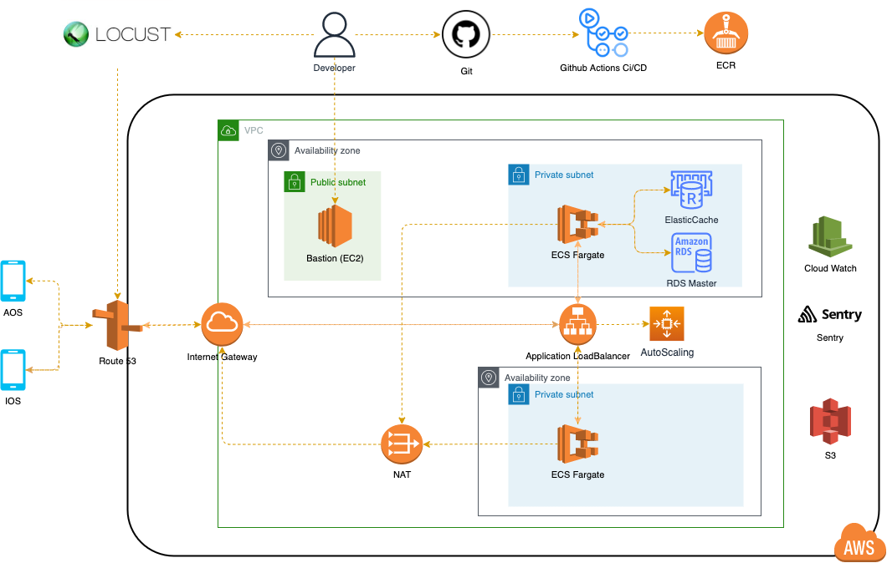

# 가슴속 삼천원 백엔드
> 백엔드에서는 v2.0.0부터 마이그레이션을 통해 새롭게 프로젝트를 진행하고 있습니다.


[](https://codecov.io/gh/depromeet/3dollars-in-my-pocket-backend)


### 프로젝트 설명
🐟**가슴속 3천원**🐟은 전국 붕어빵 지도로 시작하여 전국 길거리 음식점 정복을 꿈꾸는 프로젝트입니다. **디프만**(디자이너와 프로그래머가 만났을 때) 7기 파이널 프로젝트에서 개발되었으며 이후에 **17만명의 사용자**와 함께 지속적으로 업데이트하고있습니다.

### 다운로드
- [AppStore](https://apps.apple.com/kr/app/%EA%B0%80%EC%8A%B4%EC%86%8D3%EC%B2%9C%EC%9B%90-%EB%82%98%EC%99%80-%EA%B0%80%EA%B9%8C%EC%9A%B4-%EB%B6%95%EC%96%B4%EB%B9%B5/id1496099467)
- [PlayStore](https://play.google.com/store/apps/details?id=com.zion830.threedollars)


## Tech Stacks
### Language & Framework
- Java 11, Kotlin 1.5
- Spring Boot (Spring Framework, Spring MVC)
- Spring Data JPA (Hibernate) + QueryDSL
- Spring Batch
- Feign Client
- Gradle
- Junit 5

## Infra
### 아키텍처 (Production)


### Production
- ECS Fargate
- RDS (MariaDB), flyway
- ElasticCache (Redis)
- S3
- Application LoadBalancer
- GitHub Actions CI/CD
- Sentry, CloudWatch, Locust

### Development
- EC2, Nginx, Docker compose
- RDS (MariaDB), flyway
- Redis
- S3
- GitHub Actions CI/CD

## Installation
### with gradlew

```bash
./gradlew clean bootJar

java -jar threedollar-api/build/libs/threedollar-api.jar

java -jar threedollar-admin/build/libs/threedollar-admin.jar  
```

### with docker-compose

```bash
docker-compose up --build
```
